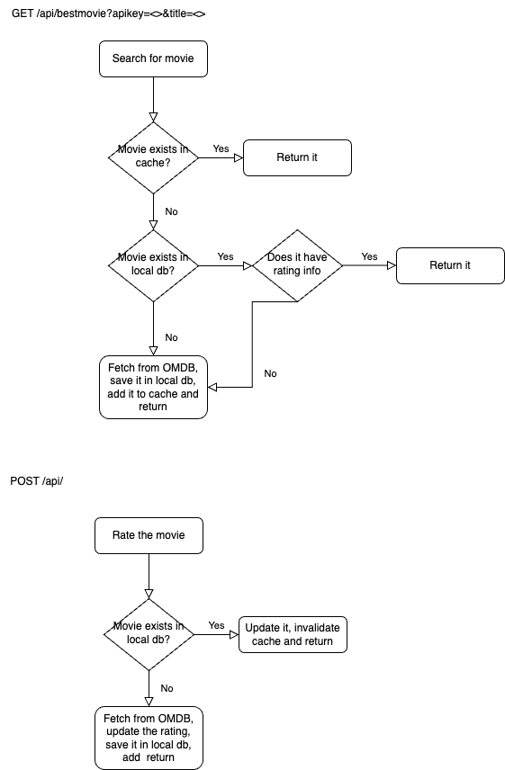
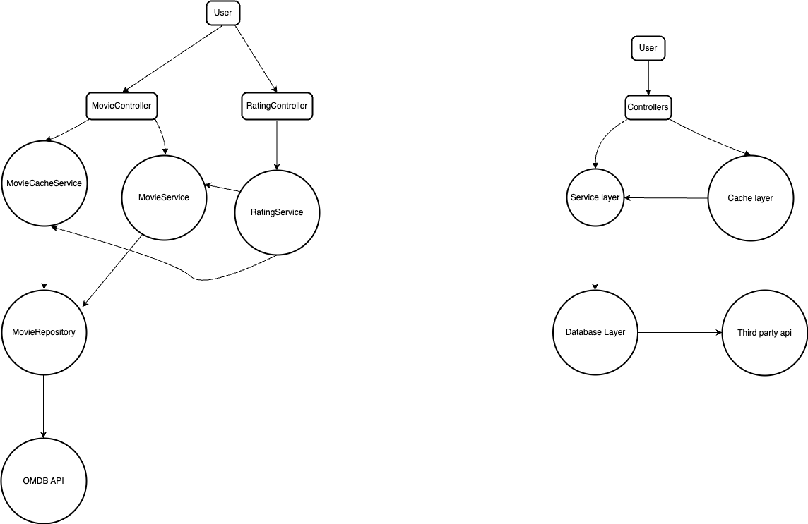

# High Level Design

This web application provides a GET endpoint to fetch the movie details from OMDB. If the \
movie details is present in cache then it will be immediately returned to user else \
it will be searched in the database. If it doesn't exist in db then a request to OMDB will \
be made to get details. After that the movie will be stored in the db and added to cache \
for future fast lookups

A POST endpoint is provided where user can rate a movie by passing the movie name and rating. \
If the movie exists in db, the new rating is calculated, the entry in db is updated and the entry \
in cache is invalidated so that users wont get the stale data. If users try to search for movie \
after providing rating, it will be fetched from db again and loaded into cache. If the movie \
doesnt exist in db, it will be fetched from OMDB and then stored in db

Another GET endpoint is provided which will return the top (10 by default) rated movies ordered by \
box office value in descending(default) order. Users can change the order and can specify different \
amount of movies to be returned as well.

NOTE: Since the db will be empty initially, running this endpoint will return empty list. So first we \
need to fetch movie details from OMDB and then run this endpoint

When the application starts, it will read from academy_awards.csv file and then store the movie \
details in db. Since the file doesnt have info about votes and ratings, when a user searches for movie, \
it will be fetched from OMDB and then updated in local db.
If you provide a proper omdb api key in [properties](src/main/resources/application.properties) file under \
`omdb.api.key` then it will try to fetch the missing details from OMDB and stores that in local db else it will be skipped.

Caching mechanism is used to prevent frequent db lookups which speeds up the rest controller response and \
also helps to scale up very easily. A scheduler job is provided which runs every 5 minutes to clear out the cache \
as we dont want to store the stale data in cache forever.

Also I have just used one entity Movie to store all info and not a separate entity Rating to store rating related info. \
Since we are not concerned with who gave rating to a movie, we dont need one to many relationship between movie and rating.

## Flowchart

  

## System context

